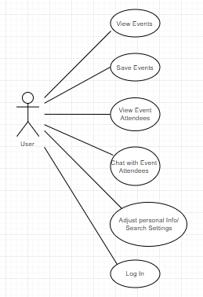
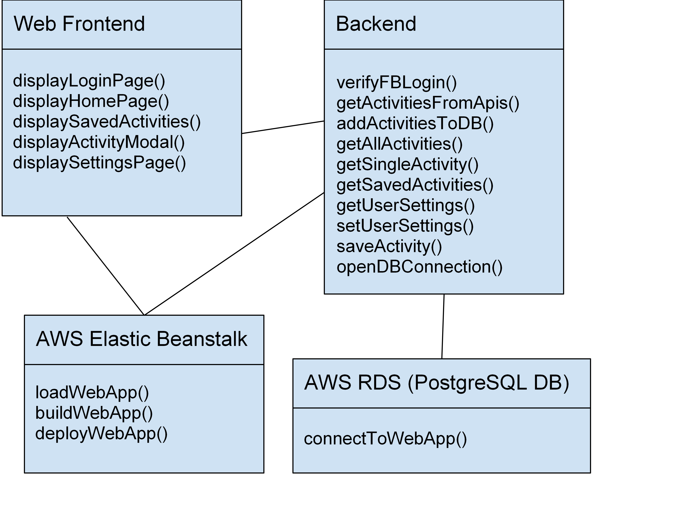

# Software Design Description Document

## 6.1 Introduction
This document presents the architecture and detailed design for the software for the Bored & Broke (B&B) project. This project will allow users to create an account using their Facebook account login information. They will then be able to browse through a selection of activities within a selected distance, get information about them, and save them to their saved page.  When saving an activity, the user can add an activity specific bio for other users, who have saved the activity, to see. After saving an activity, the user can look through the other bios for that event. The user can then contact another user by clicking on their activity specific bio, which will then lead them to Facebook messenger.

### 6.1.1 System Objectives
The objective of this application is to provide users with activities to do that are within their budget. The activities shown are only ones located in their area. Their location, radius, and price range can easily be changed on multiple pages of the website. “Likes” are not displayed so true interest drives the attraction to events. Users are also given the opportunity to meet new people within their area who have saved the same events as them. Meeting new people based on their taglines and bios creates genuine connection, rather than interest based on appearances that is generally found in applications that use pictures. The site will be easy to navigate, with a dropdown provided on every page so the user can easily switch from one page to another.

### 6.1.2 Hardware, Software, and Human Interfaces
#### 6.1.2.1 Human Interface: Mouse and Keyboard
In order to navigate through the interface, a user will make use of a mouse and a keyboard, which will allow the user to interact and initiate events on the web application through clicks and keypresses.
#### 6.1.2.2 Human Interface: Machine
Users will be required to use a machine in order to access the web application. This machine must be a desktop computer, laptop, or mobile device, all of which make use of a monitor or screen that allows an interface to be displayed.
#### 6.1.2.4 Software Interface: Graphical User Interface (GUI)
Users will interact with Bored and Broke’s Graphical User Interface. This graphical interface makes use of different interface elements such as dropdown menus for navigation, image thumbnails to display a library of activities, modals for displaying a specific activity, and buttons typically used for submitting and saving user-modified information.
#### 6.1.2.5 Software Interface: Database
The database holds all the data from the web application. Data that will be stored include activities and user account information. The user interface interacts with the database in order to give the user the proper information they are searching for.
#### 6.1.2.6 Software Interface: Server
The server hosts the web application as well as all the information stored within the database.
#### 6.1.2.7 Hardware Interface: Wireless/Wired Networking
Since Bored and Broke is a web based application, a wired or wireless connection will be needed in order to access the application via a web browser.

## 6.2 Architectural Design
The overall design of our system is split up into four sets, the Web Frontend, Backend, AWS Elastic Beanstalk, and AWS RDS (PostgreSQL DB). The Web Frontend set of class definitions includes the display of the Login page, Homepage, Saved Activities, Activity Modal, and Settings page. The Backend set includes verifying the User’s Facebook login information, getting the activities from the various APIs, adding these activities to the database, displaying all of the activities, getting a single activity, getting the user’s saved activities, getting the user’s settings, changing or setting the user’s settings, and opening the database connection. The AWS Elastic Beanstalk set will include loading, building and deploying our web application. The AWS RDS set will include connecting to the web application. The Web Frontend set is connected to the Backend set and AWS Elastic Beanstalk set. The Backend set is connected to the Web Frontend, AWS Elastic Beanstalk and AWS RDS. The AWS set is connected to the Web Frontend and the Backend. The AWS RDS is connected to the Backend.

### 6.2.1 Major Software Components
#### 6.2.1.1 - Web Frontend
This component will be made up of four pages that allow the user to interact with the application. The first of the four pages is the Login/Create Account page, which will handle user login or account creation. Next is the Settings page, which will show user account information.  Third is the Homepage that will be populated with the activities that the user can navigate through.  Each activity, if clicked on, will lead to a single activity modal, which holds more information about the specific activity.  The final page is the Saved Activities page, which shows all of the activities that a user has saved from the Homepage.
#### 6.2.1.2 - Database
This component will store all of the activity and user account information. Queries will be used to access the information within the database and apply it to the user interface, as well as save information, gained from the user interface, into the database.
#### 6.2.1.3 - Backend
This component allows the user interface to interact with the database and handle the constant transferring/requesting of data. Users will be able to view and adjust their account information, such as price range and location.  Furthermore, activities can be saved to the database in order for its information to be retrieved later. The backend will also handle the multiple different API calls that return activity information, as well as provide login/account creation capabilities.

### 6.2.2 Major Software Interactions
The source code of the B&B source code is loaded onto an Amazon Web Services (AWS) Elastic Beanstalk. The AWS service then deploys the B&B application by running the code on a server. The Elastic Beanstalk allows the B&B application to send and accept HTTP requests, which calls the following API’s to gather information about various activities: Eventful, EventBrite, and TicketMaster. The Facebook Account API is also called to verify users through Facebook login.

The PostgreSQL database runs through the AWS Relational Database Service (RDS). The B&B application connects to the the database by opening a connection using the Sequelize.js package. Functions in the B&B application also use Sequelize.js to run SQL queries to input and retrieve information

### 6.2.3 Architectural Design Diagrams
#### UML Case Diagram

#### Data Flow Diagram

#### Class Diagram

## 6.3 CSC and CSU Descriptions Section
### 6.3.1 Detailed Class Descriptions
The following sections provide the details of all classes used in the Bored and Broke application.
Classes:
* Homepage
* HomepageSettings
* Index
* LoginButton
* LoginCreateAccount
* NavigationBar
* SavedActivities
* Settings
* SingleActivityModal
* activityRetriever
* Database
* Deduplicator
* Models
### 6.3.2 Detailed Interface Descriptions

#### 6.3.2.1 Login/Create Account Page CSU: The user will create an account
by logging in through their Facebook account, interfacing with Facebook’s
API. A returning user will also login in the same way.
#### 6.3.2.2 Settings Page CSU: When our user updates their settings they will be
interfacing with the user table of our database.
#### 6.3.2.3 Homepage CSU: Here the user interfaces with our API calls that return
the events which match their specifications
#### 6.3.2.4 Single Activity Modal CSU:
This CSU again involves interfacing with the
API’s to get event information. The user will also be interfacing with our user
database which holds information about every other user who saved this event.
The user will also be interfacing with the Facebook API if he/she chooses to
message one of the other users who saved the event (since the messaging is
done through Facebook)

### 6.3.3 Detailed Data Structure Descriptions Section
#### 6.3.3.1 Login/Create Account Page CSU:
This CSU makes use of the User data structure. The User data structure holds all the information about the user. If someone logs onto the site who does not have a Bored & Broke account, a User data structure will be created with their information. The User data structure is a dictionary consisting of keys and values. The keys are: “id”, “name”, and “bio”. The “id” key is automatically filled with their unique Facebook id. The rest can be set manually during account creation. This information is saved to the database upon account creation.
#### 6.3.3.2 Settings Page CSU:
This CSU also makes use of the User data structure, which is described in 6.3.3.1. The Settings page allows the user to change the information that is stored in their account after account creation has been completed. The “id” field can never be changed. The updates are saved in the database.
#### 6.3.3.3 Homepage CSU:
This CSU displays many Activity data structures. The Activity structures are filled with information that is stored in the database. The Activity data structure holds information about each activity. It is a dictionary consisting of keys and values. The keys are: “name”, “date”, “location”, “imageUrl”, “link” (to an external site), “price”, and “description”. The homepage displays many activities with information from these Activity structures.
#### 6.3.3.4 Single Activity Modal CSU:
This CSU displays a singular activity using the data from a singular Activity data structure, which is described above in 6.3.3.3. It also displays other users who have shown interest in the activity, which is passed to the frontend in a User data structure (described in  6.3.3.1).

### 6.3.3 Detailed Data Structure Descriptions Section
### 6.3.4 Detailed Design Diagrams Section
#### UML Case Diagram

#### Data Flow Diagram

#### Class Diagram

## 6.4  Database Design and Description Section
### 6.4.1  Database Design ER Diagram Section
### 6.4.2  Database Access Section
Bored&Broke takes advantage of the AWS Relational Database Service (RDS) which allows for easy database setup and connection to the elastic beanstalk environment. The frontend of the website will access the database through use of Sequelize, which is an Object/Relational Mapper. Sequelize is a javascript library; therefore, database tables can be created and queries can be ran through javascript.

User’s access that database through the frontend; however, can only adjust information that pertains to them.  User’s can create and adjust their bios, save activities to their saved page, add taglines to saved activities, and adjust their user settings.

### 6.4.3  Database Security Section
Since the Bored&Broke database is through Amazon RDS, there is a multitude of advanced security preferences built in. There are features that control who can log in to the database, encryption services, Identity and Access Management (IAM) to set permissions, security groups to control what IP addresses can connect to the database, and more. When we launch our application, we will restrict the IP addresses that can connect to our database to only the server that our application is running on. This prevents others from making changes to our database. Due to this, our backend team does not need to implement database security.
